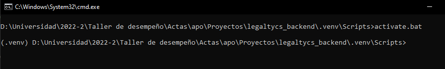
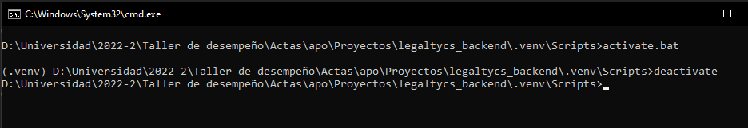

# Proyecto legaltycs backend

<!--toc:start-->
- [Proyecto legaltycs backend](#proyecto-legaltycs-backend)
  - [Descripción](#descripción)
  - [Endpoints](#endpoints)
    - [Login user [ /api/login ]](#login-user-apilogin)
    - [Register user [ /api/register ]](#register-user-apiregister)
    - [Test authenticate route [ /api/test ]](#test-authenticate-route-apitest)
  - [Ejecución en entorno de desarrollo :rocket:](#ejecución-en-entorno-de-desarrollo-rocket)
  - [Verificar que el entorno virtual se habilito](#verificar-que-el-entorno-virtual-se-habilito)
    - [Ejecutar el siguiente comando para descargar los paquetes necesarios](#ejecutar-el-siguiente-comando-para-descargar-los-paquetes-necesarios)
  - [Para desactivar el entorno virtual ejecute](#para-desactivar-el-entorno-virtual-ejecute)
<!--toc:end-->

## Descripción

## Endpoints

### Login user [ /api/login ]
- Body
```
{
    "username": "",
    "password": ""
}
```
### Register user [ /api/register ]
- Body
```
{
    "username": "",
    "password": "",
    "lastname": "",
    "email": "",
    "name": ""
}
```
### Test authenticate route [ /api/test ]
Proporcione un Bearer Token

Repuesta sin token
```
{
    "menssage": "You do not have access without a valid token"
}
```
Repuesta con token
```
{
    "mensaje": "Entre"
}
```


## Ejecución en entorno de desarrollo :rocket:

- Ingrese a la carpeta del proyecto donde se encuentre el archivo main y abra un terminal

- Ejecutar los siguientes comandos en orden

```
$ pip install virtualenv
$ python -m venv .venv
$ .\.venv\Scripts\activate (Verifique que se active el entorno virtual con este comando)
```
## Verificar que el entorno virtual se habilito



### Ejecutar el siguiente comando para descargar los paquetes necesarios

```
$ pip install -r requirements.txt 

```
- Para desactivar el entorno virtual tiene que ejecutar el comando

```
$ deactivate

```
- Cree un archivo .env an la carpeta raiz del proyecto con los siguientes atributos

```
SECRET=CLAVESECRETA
HOST=localhost
USER=root
PASS=root
DB=legaltycs
```
- Cree una base de datos mysql con el nombre "legaltycs" y ejecute la siguiente query

``` sql
create table user(
    id varchar(255),
    username varchar(20) unique,
    password varchar(255),
    name varchar(255),
    lastname varchar(255),
    email varchar(255) unique,
    PRIMARY KEY (id)
);
```
- Ejecute el servicio con el comando
```
$ python main.py
```

## Para desactivar el entorno virtual ejecute

Verifique que se desactive el entorno virual cuando deje de trabajar con el proyecto.

```
$ deactive 
```


